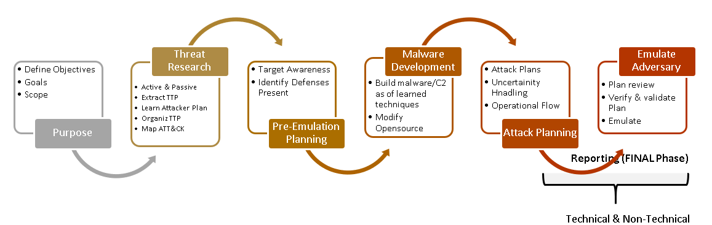
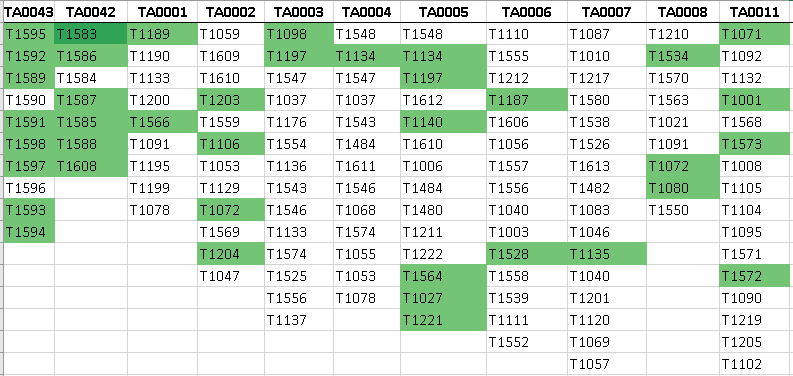

# Threat-Based-Adversary-Emulation
Our goal here is to replicate threats in stalthy way and emulate unknown attack paths.
Reference point for TTP's is ATT&CK and for threats we are using different security blogs, threat research forums, threat intelligence to build understanding for threats.

**Repository contains Arsenal related directories**

This Repo is comprised of the following Major 3 elements:
- **Threat Research:** Contains malware samples, tools from adversary, Ransomwares, worms, binders, spoofers etc in **Hack-tools** & **Malware Rseearch**
- **Arsenal:** Containes directories from chapter 4
- **PCAP Activty/logs/Dat files from Endpoint:** Part of hybrid evaluation from chapter 6 (Thesis)
- **Reports in PDF directory:** Reporting about whole activty, includes technical as well as non technical.

## Attack Plan

